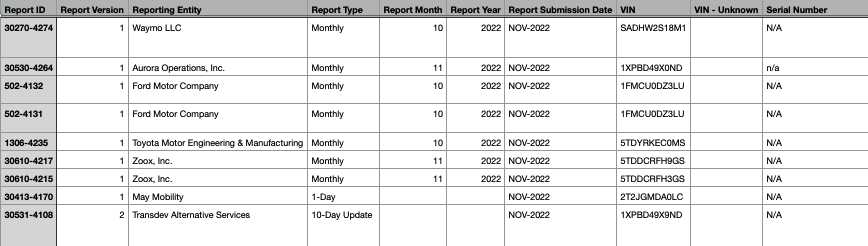
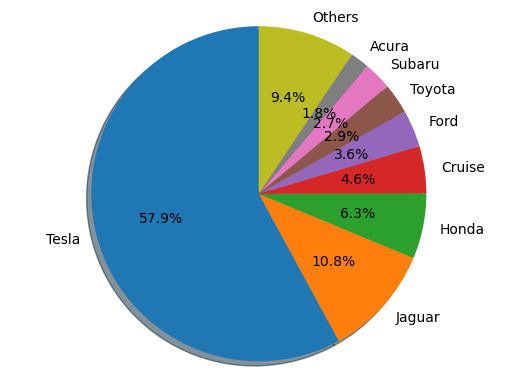
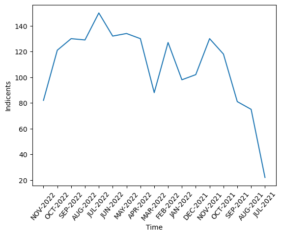
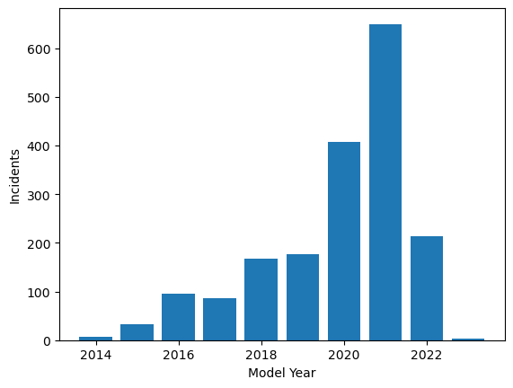
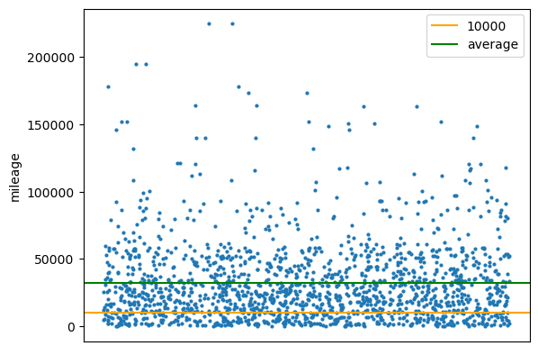
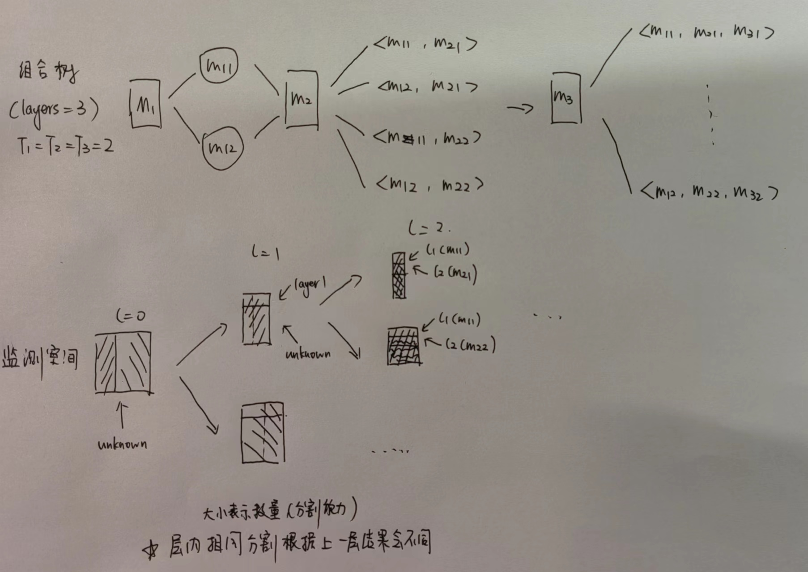
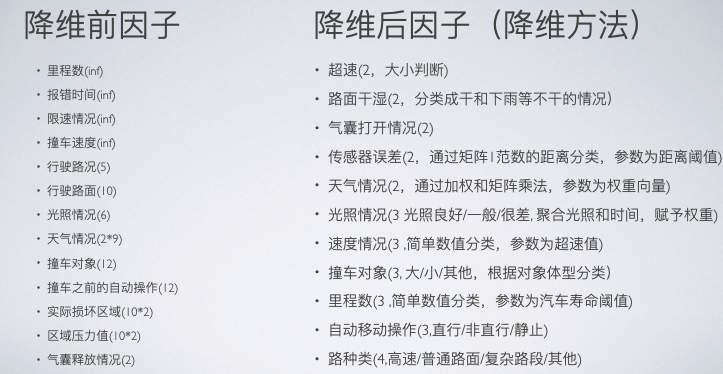

# 基于自动驾驶数据集的根因分析

## 摘要

商业自动驾驶是当前的热门领域，然而，越来越多的自动驾驶事故引发了人们对此的担忧。本实验通过标准的数据生命周期处理方式，通过建模和数据挖掘的方法来定位问题所在。本文采用权威事故统计数据集，首先通过数据的切片和清洗来结构化事故的条目，通过数据可视化来探索事故分布的初等规律，之后通过**根因分析（RCA）**研究方法的，研究问题的**最大分割组合**，**自主建立，研究和实现搜索树模型**，通过对与**数据降维处理**和**搜索树剪枝优化**，再进行**ResultRanking**，成功**计算出最优组合**，成功把搜索空间从**百万集合降低到万集合**，剪枝率高达**98.78%**

## 研究背景

近些年来，购买和驾驶新能源汽车逐渐成为一种趋势，同时随着科技的发展，越来越多的高新技术企业涌入新能源和自动驾驶的赛道，其目标是研制出环保而且可替代人类驾驶的能源和自动化技术。

但是，由于自动驾驶技术的商用化在近两年才刚刚起步，人们对于其**安全性**一直处于一个比较担忧的状态。事实也是如此，按照SAE International 的标准，自动驾驶可以形象地分为以下几个阶段：

- **Level 0** — no automation
- **Level 1** — hands on/shared control
- **Level 2** — hands off
- **Level 3** — eyes off
- **Level 4** — mind off
- **Level 5** — steering wheel optional

现在的商用自动驾驶技术主要处于Level 2-3级之间，也就是高级驾驶辅助系统（**ADAS**），并不能完全地替代人类的决策和驾驶。于此同时，由于此技术的普及，近些年由自动驾驶汽车造成的事故频发，模型问题，质量问题是这些事故的诱因。

本次研究是站在一个数据学生的视角，通过数据集，数据处理以及数据挖掘的方法来定位事故背后的原因，主要针对由ADAS模型造成的事故研究

## 数据集介绍

实现需要的是自动驾驶事故的详细统计，不仅包含事故发生的时间，地点，事故结果等常规车祸所要记录等数据，同时要求必须包含与**自动驾驶辅助模型**有关的数据，这些数据分为以下两种：

- 外因，比如天气情况，光照情况等影响传感器判定的因子
- 内因，比如传感器数据，里程数等影响汽车本身监测能力好坏的因子

在保证以上数据完整性的同时也要求数据的**权威性**，由于研究的是商业模型的安全性，需要的是**实际的公路数据**，而非研究或出厂测试时候的测试数据

### 数据来源

- [NHTSA](https://www.nhtsa.gov/laws-regulations/standing-general-order-crash-reporting)，美国国家公路交通安全管理局

- 以下为一部分条目展示



来自美国政府的唯一权威和标准的数据，通过美国标准交通事故统计纸质报告的形式统计，数据本身具有**法律效益**，能够满足以上的要求，于此同时，在对外展示的部分已经对于敏感信息进行模糊处理，足够保证数据的**安全性**，数据本身来自该政府机构的2021年6月到2022年11月的统计，是首次提出的单独对于自动驾驶事故的统计数据，具有很强的**时效性和权威性**

数据本身就是`csv`文件，无需再做进一步的处理

### 数据预处理

#### 数据切片

利用`pandas`库的`DataFrame`类，直接倒入csv数据并且**关联化**，为了便于后续的处理，首先对每个单独的因子进行切片，把明显和原因无关的数据剔除，比如报错者信息，VIN码等，由于条目多达122项，因此先打印出来之后再通过序号切片，以下为示例代码：

```python
DATA_PATH = "./datasets/aggregated_data.csv"

df1 = pd.read_csv(DATA_PATH)
# get heads of columns
info_draft = open("./info.txt", "w")
for head in df1.columns:
    info_draft.write(str(head))
    info_draft.write("\n")
info_draft.close()

# Sample of items
CPMove = df1.loc[:, "CP Pre-Crash Movement"] # item vector
CPContactArea = df1.iloc[:, 72:83]# item matrix
```

以下为保留后的因子条目：

- 报错的公司（Make）
- 报错的月份（Report Submission Date）
- 使用的自动化模型的年份（Model Year）
- 里程数（Mileage）
- 报错的时间（Incident Time (24:00)）
- 行驶的路类型，高速还是小路（Roadway Type）
- 行驶的路况（Roadway Surface）
- 限速情况（Posted Speed Limit (MPH)）
- 光照情况（Lighting）
- 天气情况（Weather矩阵）
- 撞上的对象（Crash With）
- 撞上之前的自动操作（CP Pre-Crash Movement)
- 接触压力感知部位（CP Contact Area矩阵）
- 传感器导致的气囊释放情况（SV Any Air Bags Deployed?）
- 传感器撞上之前的速度（SV Precrash Speed (MPH)）
- 传感器接触区域（SV Contact Area 矩阵）

#### 数据清洗

对于条目当中的异常信息剔除成空白，空白信息通过`fillna()`方法先填入标志符，并不需要进行更多的清洗操作，之后根据模型的建立会设定专门的处理方法

## 数据统计与可视化

以下统计工具采用`DataFrame`的成员函数`value_counts()`来实现，画图则采用`matplotlib`库实现，以下的数据都是**事故分布图**，而非市场分布图

- 报错单位饼图分布

方法统计数据，通过对数据乘以归一因子$\eta$，来实现数据的百分比化，对于数据量小于1.8%的部分统一设置为其他类，防止低样本数据过密，影响饼图的美观



明显看到Tesla制造的自动驾驶汽车事故率占比最高，当然这也是由于其销量遥遥领先导致的

- 事故发生月份折线图



可以看到时间的分布是比较平均的，在2022年7月出现峰值，而2021年的7月减少，主要是因为统计的时间可能并非从7月开始统计，之前的数据未参照此标准

- 模型年份直方图



可以看到模型的年份主要集中在2020年以后，也符合自动驾驶的研究时间轴

- 里程数分布图

去除里程数过高和过低的点，划定一根**10k mile**的里程线表示**里程数较低的车**，划定**平均线**来区分高/低于平均里程数的分布，由于数据只有一维里程数，对于x轴均匀随机散点和隐藏，让图像更加清晰



可以看到主要的事故集中于中/低里程数的自动驾驶汽车，特别是平均线以下散点非常的密集

## 根因分析

**前言**：以下大部分内容出于自己的思考，如果以下提出的概念，模型，算法有和RCA权威概念不一致，请以权威概念为准

### 方法介绍

- Wikipedia

>In [science](https://en.wikipedia.org/wiki/Science) and [engineering](https://en.wikipedia.org/wiki/Engineering), **root cause analysis** (**RCA**) is a method of [problem solving](https://en.wikipedia.org/wiki/Problem_solving) used for identifying the root causes of faults or problems.[[1\]](https://en.wikipedia.org/wiki/Root_cause_analysis#cite_note-1) It is widely used in [IT operations](https://en.wikipedia.org/wiki/IT_operations), manufacturing, [telecommunications](https://en.wikipedia.org/wiki/Telecommunications), [industrial process control](https://en.wikipedia.org/wiki/Process_control), [accident analysis](https://en.wikipedia.org/wiki/Accident_analysis) (e.g., in [aviation](https://en.wikipedia.org/wiki/Aviation),[[2\]](https://en.wikipedia.org/wiki/Root_cause_analysis#cite_note-2) [rail transport](https://en.wikipedia.org/wiki/Rail_transport), or [nuclear plants](https://en.wikipedia.org/wiki/Nuclear_plant)), [medicine](https://en.wikipedia.org/wiki/Medicine) (for [medical diagnosis](https://en.wikipedia.org/wiki/Medical_diagnosis)), [healthcare industry](https://en.wikipedia.org/wiki/Healthcare_industry) (e.g., for [epidemiology](https://en.wikipedia.org/wiki/Epidemiology)), etc. Root cause analysis is a form of deductive inference since it requires an understanding of the underlying causal mechanisms of the potential root causes and the problem.

简而言之，RCA主要研究因子的**组合**来发现造成问题的原因，可以做到**排除无关因子**和评价**组合影响程度**

而因子组合问题是一个**NP问题**，假设一共有n个因子，每个因子的观测值只有True/False两种结果，搜索空间的规模也至少有$O(2^n)$种，搜索空间随因子数n呈指数增长关系，计算数非常大，然而

目前研究的主要快速算法一共有两种：

- 关联规则挖掘
- 启发式搜索

像是神经网络做的多分类结果目前并不是很好，鉴于个人的能力，本次实验采用的是第二种方法，建立**搜索树**来解决这一NP问题

### 建立模型

避免长篇大论，以下用我自己的理解来表达，通过数学的语言来描述模型建立和算法

#### 数学模型

- 监测空间建立

定义一个自动化实现目标A，自动化是根据因子序列K来操作的，因子之间的**相关性未知**，拥有**时间轴分布**，每一个因子并**不属于任何公共空间**，只属于自己的**分布空间**$\mathbb{T}$
$$
K = \{k_1,k_2,...,k_n|k_i =f_i(timeline)\}
$$
由于实际场景当中监控函数是离散的，我们也可以用向量来表示每一个因子的检测值$M_i$
$$
M_i = \{m_{ij}\},m_{ij}\in \mathbf{Range}(f_i(t_j))=\mathbb T
$$
由此可以得到监测矩阵空间M
$$
M = (M_1,M_2,...,M_n)
$$

- 监测空间分割

假设监测空间的因子数为**层数**，每一个因子的可能分布为该因子的**维数**

假设一个因子的维数为u，根据因子分布空间的每一个可能的值，可以划分出u个不同的**监测子空间**，监测子空间的可能取值是**唯一的**
$$
M_i = ({M_{i1},M_{i2},...,M_{iu}}),\mathbf{set}(M_{ij}) = \{a\},a\in\mathbb{T}
$$
同样地，在**下一层**，对于该层的分布空间和监测空间的维数降成1，因为对于该层的分布空间已经形成了u种分割

监测空间分割定理：i层的监测空间为所有非奇异子分割空间的直和，定理由定义显然成立

- 组合

对于本层的监测子空间和上一层的监测子空间组合，最终每一个监测因子的维数降为1，称为一个有效组合

每一个**已被分割的**层，分割结果分别加入**组合序列**，**有效组合序列的长度等于层数**

以下为图示



- 有效空间加序(**ResultRanking**)

研究的是有效组合空间当中，哪些分割方法是**最优的**，评判标准为**组合分割能力**，并且进行排序

- 单因子分割能力(**Isolation Power**)

一个用于评价一层当中监测空间分割结果的映射，需要把分割分布转化为评价值

要求评价函数拥有以下的数学性质，当**均匀分布的时候**分割能力**为下界**，**退化分布的时候**分割能力**为上界**，随着分割能力函数值呈单调关系
$$
\begin{aligned}
&f:T\rightarrow R\\
&L=\max f(M) \Longrightarrow p(M)=U(0,1)\\
&H=\max f(M) \Longrightarrow p(M)=(0,0,...,1,...,0)
\end{aligned}
$$

---

- 总体因子分割能力

对于有效组合空间的评价函数，满足类似于单因子分割能力的性质，是离**无分割组合**的距离度量
$$
\begin{aligned}
&g:T^n\rightarrow R\\
&L=\min g(M) \Longrightarrow \min dist(L,M) ,M=L \\

&H=\max g(M) \Longrightarrow \max dist(L,M) 
\end{aligned}
$$
因此这个函数只是一个抽象的概念，需要确定的是其**合理的距离函数**

以上是整个搜索树的数学模型，建立的数学性质和名词设定，只要是便于描述后文实际处理的时候的步骤

#### 代码接口


- 构建搜索树节点的类

我们利用之前数据预处理之后的因子切片来定义层级，通过构建`class search_node`来实现每个节点以及包含的信息和方法，最后通过递归调用来运行搜索过程，接下来来看一下具体的实现过程

- 节点包含的信息

监测矩阵可以不用数值代替，但是出于尽可能减小信息量的空间开销，需要建立一张**对照表**，把分布空间T和所代表的数值对应，也就是`enum()`操作，同时规定-1为不分割

```python
class search_node:
    # search_mat: only include this layer and next ones
    # For example, depth = 1, only includes prev_mat[1:]
    # given_size: how many items remaining from pre-selectTree
    # given_iso: Sum of pre isolation powers
    # pre state: Result of pre-selectTree
    def __init__(self, 
                search_mat, # 当前的搜索子空间
                depth, # 当前的层级
                given_size, # 当前子空间的规模（上一层切片的结果）
                given_iso, # 继承之前的分割评价值，是为了计算总体因子分割能力
                pre_state, # 之前选取的分割信息
                 
                ## 最后两个是剪枝参数，之后剪枝过程会提到
                iso_threshold = 0.89, 
                size_thershold = 3):
```

- 分割监测空间，取得分布

设计的算法通过已知的分布种类，开辟**分布数组**和**分割位置记录矩阵**

只需要**一次遍历**即可做到**统计分布**，**计算概率**和**分割矩阵**，

```python
def get_distribution(self):
        # Get the distribution first
        for i in range(self.attr_type):
            self.distri.append(0)

        # Only need to travel once through
        for i in range(self.given_size):
            self.distri[self.layer[i]] += 1
            self.mat_for_slice[self.layer[i]].append(i)
        
        for i in range(self.attr_type):
            self.amount_distri.append(self.distri[i])
            self.distri[i] /= self.given_size
```

- 计算分离度

单因子分割能力函数，本次采用的度量是**信息熵**，也就是给定分布之后**信息的增加量**，满足假设条件

$\mathrm{H}(X)=\sum_i \mathrm{P}\left(x_i\right) \mathrm{I}\left(x_i\right)=-\sum_i \mathrm{P}\left(x_i\right) \log _b \mathrm{P}\left(x_i\right)$

当遇到退化分布的时候直接给予最小值即可，为了防止信息熵极值，全部采用0.5作为度量下界

```py
def iso_power(self):
        
        sum = 0
        for i in range(self.attr_type):
            temp = self.distri[i]
            if temp == 0 or temp == 1:
                return 0.5   
            sum -= temp*(np.log2(self.distri[i]))
        
        return sum
```

- 分割监测矩阵

通过之前的分割位置记录矩阵，来对于当前的监测矩阵切片，准备进入下一层的组合树

```python
def slice_mat(self):
        for res_index in range(self.attr_type):
            index_mat = []
            for i in range(len(search_mat) - 1):
                layer = i + 1
                layer_temp = []
                for j in range(len(self.mat_for_slice[res_index])):
                    layer_temp.append(search_mat[layer][self.mat_for_slice[res_index][j]])
                index_mat.append(layer_temp)
            self.sliced_mat.append(index_mat)
```

- 下层搜索

这一部分由于过长，以及暂时没有提到剪枝策略，所以暂时写伪代码标识

非常关键的一点是，进入下一层除了子监测矩阵之外，**不分割**也是一种分割，同样需要加入下一层的组合树当中

采用的是**前序DFS**搜索，由于算法需要遍历整个搜索树，所以单线程情况下可以改变成其他的遍历方法，比如BFS等，不会影响搜索效率

```python
def succeed(self):
	if self.depth == bottom:
		add (iso, state_vec) into unranked_result
	# If this Node is A->B, and B has isolation, branch A->b1->C,..., A->bn->C, A->C
	self.slice_mat()
  for i in range(self.attr_type):
  new_node = search_node(self.sliced_mat[i], 
                         self.depth + 1, 		
                         self.amount_distri[i], 
                         self.given_iso + node_iso_power, 
                         self.pre_state + [i])
  new_node.succeed()
  
  skip_level_node = search_node(search_mat[self.depth + 1:], 
                                self.depth + 1, 
                                self.given_size, 
                                self.given_iso + 1, 
                                self.pre_state + [-1])
  skip_level_node.succeed()
  
```

- 算法

构建好搜索节点类之后，直接输入矩阵，从根节点开始搜索即可

```python
begin_node = search_node(search_mat, 0, length, 0, [])
begin_node.succeed()
```

### 数据处理：降维

搭建好模型之后，我们首先要处理**输入监测矩阵**等问题，由于数据预处理时已经把因子切片，所以只需要考虑以下的几个因素：

- 因子**维数**

在尽可能降低维数的同时保留信息量，在RCA当中也被称为**粒度分析**，

如果粒度太粗，会导致严重的信息损失，从而使得模型置信度降低

如果粒度太细，相似的值无法形成**有效聚类**，分割出的**监测子空间**太小，也会降低模型的置信度

- 因子数量，组合树的**层数**

尽可能地保留有关信息，对于某些**关联度强烈信息**可以通过**预组合**来降低层数，降低层数比降低粒度更加有效

如果层数是在太多，甚至可以用分离计算法获得**局部最优值**，再通过局部最优组合成全局最优，当然，本次实验当中只有11层，并不需要用到这个方法

- 根据enum每个因子分布，形成查找映射，输入只需要输入数字矩阵即可，主要针对**非数域分布空间**

---

以下展示对于每一个详细因子的处理方法，由于代码过长，详细请见[code](./code.ipynb)



- 二维因子

1.超速`b_overspeed`：(inf,inf)->2

​	通过**路面限速值**和**传感器检测值**的**大小比较**，获得一个bool结果，

​	输出结果：超速为True

2.路面干湿`b_dry_surface`：5->2

​	绝大部分的数据为Dry/Wet，直接区分成这两类，

​	输出结果：Dry为True

3.气囊打开情况`b_airbag`:2->2，Y/N -> True/False

​	简单的对应转换

4.传感器误差`b_sensor`(2\*10, 2\*10)->2，

​	通过计算实际接触区域矩阵和传感器检测区域矩阵的**矩阵1范数**距离，设定一个**偏差边界**来判定传感器是否出现明显偏差，在本实验当中参数为2，也就是两个传感器出现偏差（一共10个）

​	输出结果：低于边界为0，高于边界为1

5.天气好坏`b_weather`2*9->2

​	通过加权降维，每一个w都是设定的权重，**权重向量**为参数
$$
M=M_{weather}W,W\in R^{9\times 1}\\
W=(w_1,...,w_9)^T
$$
​	定义天气利于自动驾驶驾驶为正，不利为负,例如晴天权重为10，雾天权重为-10

​	输入矩阵为每一项的统计结果Y/N，转化为0/1矩阵进入加权操作即可

​	输出结果大于0为0，小于0为1

- 多维因子

6.光照情况`m_light3`：6->3

​	分类成光照较好/光照一般/光照很差情况，

​	分别对应原始数据的Daylight/(Dawn/Dusk/Night lighted/Others)/Night without lighted)，

​	对应输出为0/1/2

7.撞车前速度`m_speed3`：inf->3

​	输入撞车速度，设定**两个速度边界**为参数来界定低速/中速/高速，本实验的两个参数为35，70 mile/h

​	对应输出为0/1/2

8.撞车对象`m_crashwith3`:12->3

​	输入撞车对象字符串，分成大车/小车/其他三类，

​	分别对应原始数据的(Truck/Bus)/(Van/Passenger Car/SUV)/Others

​	对应输出为0/1/2

9.里程数`m_mileage3`：inf->3

​	输入里程数，设定**两个里程边界**来定义里程数为少/中/高，本实验的两个参数为10000，50000mile

​	对应输出为0/1/2

10.撞车前自动驾驶的移动操作`m_move3`：12->3

​	输入操作字符串，分为直行/转向/静止的情况

​	对应输出为0/1/2

11.路况`m_roadtype4`:5->3

​	输入路况，分为Highway/Intersection/Street/Others四种情况

​	对应输出为0/1/2/3


以上所有的数据有少量未知值，全部采用先**统计分布**，随后采用该分布进行**蒙特卡洛选择**之后模拟

如果算力支持，以及拥有更大规模大数据，完全可以更改分割的标准，增细粒度，以上划分多数是出于数据集的规模和模型的运算速度考虑

### 模型优化：剪枝

即使经过以上的数据处理，我们可以简单计算一下组合数
$$
C=\prod u_i=3^5\times 4^5\times 5=1244160
$$
可以看到以上的降维几乎做到极限了，在如此少的层数下还有百万级别的组合，这个时候就需要对模型的搜索算法进行优化，对于某些无效的节点直接剪枝，减少无效计算

- 优化法1：排序

把因子的维数从小到大排序，由于剪枝的可能性存在，这样做可以让接近根节点的地方分支尽量少，是一种**贪心**做法

```python
sort(factors, ascending = True)
```

排序后的结果如下，由于层数不多直接手动排序，也可以采用排序算法

```python
search_mat = [b_overspeed, 
              b_dry_surface, 
              b_airbag, 
              b_sensor, 
              b_weather,
              m_light3,
              m_speed3,
              m_crashwith3,
              m_mileage3,
              m_move3,
              m_roadtype4]
```

- 优化法2：基于影响力的剪枝

如果因子所占有的子监测空间过小，那么该子监测空间很难对于全局因子影响力造成影响，子空间再分割也不够有足够置信度的分布（通常，这个子空间非常小，比如只有2列，那么很难再造成影响），由于**监测空间分割定理**的存在，该因子的所有子树也满足这个条件

需要界定一个**大小影响边界**，来区分是否剪枝，本实验的边界为2，也就是只有2列的监测空间认定为无效空间

代码实现：在`succeed()`函数当中，在**统计分布之前**判断

```python
def succeed(self):
        if self.given_size <= self.size_threshold:
            return
        self.get_distribution()
        ...
```

- 优化法3：基于隔离能力的剪枝

计算分布空间的**单因子分割能力**，如果不足，则认定**该条件分割无效**，直接**不分割**进入下一层

```python
...
self.get_distribution()
node_iso_power = self.iso_power()
# If this Node is A->B, but B cannot isolate, just change to A->C
if node_iso_power >= self.iso_threshold:
	skip_level_node = search_node(search_mat[self.depth + 1:], 
																self.depth + 1, 				
																self.given_size, 
																self.given_iso + 1, 
																self.pre_state + [-1])
	skip_level_node.succeed()
else:
  ...
```

---

通过以上三种优化方法，结果的搜索数为15189，说明以上的优化方法是非常有效的，**剪枝率高达98.78**

### 结果排序

我们用**KL散度**来度量有效组合序列和原分割之间的分离程度，满足总体因子分割能力的假设条件
$$
\begin{aligned} K L(p \| q) & =-\int p(x) \ln q(x) d x-\left(-\int p(x) \ln p(x) d x\right) \\ & =-\int p(x) \ln \left[\frac{q(x)}{p(x)}\right] d x\end{aligned}
$$
为了便于计算，实际操作的时候有一些微小的调整，这里对于每一个分量取得是**对数**，为了使结果更加好看而且递增的，对于每一个分量，信息熵在继承给下一层的时候去的是**倒数**，不改变其假设性质的满足

最后再对未排序的元组集合排序即可

```python
# rank the combinations
result_ranked = sorted(result_unranked, key = lambda x:(x[1]))
```

## 运行结果

```
Valid result:  15189
Best result:  ([1, -1, 1, 1, 1, 1, 1, 1, 1, 0, 3], 28.686613826612206)
```

解读一下也就是说，最优的组合当中**路面干湿**是影响较差的因子，其余因子影响较好，

在超速，气囊无效释放，传感器失效，天气较差，光照一般，速度适中，撞车对象是小客车，里程数中等，自动驾驶的操作是直行，路面状况为非高速，公路，街道，立交的情况下事故**最有可能发生**

基本符合常识的预期，同时在这种组合下排除掉了一个无效因子

## 思考，总结和改进

- 本次实验的大部分时间都用于思考自己的搜索树模型，最后用一种自己的数学语言来表达，希望能够足够的严谨，同时运算时间非常快，优化策略大获成功，收获很大

- 根因分析本身是用于时间序列监测的，然而改数据并未提供每个因子分布空间的时间轴，因此其实少了一种分割的方法，成为**基于时间变化**的剪枝，但是个人认为在不提供时间轴的时候也有不错的表现。其问题本身也是自动化近些年来的一个方向，特别是在控制因子过多的工业上具有很高的价值
- 数据处理的时候没想到剪枝成功率很高，其实可以将分布空间的粒度分的更细一些，或者增加一些层数
- 本次实验的计算量结果上并不是很大，如果采用更细的划分，可能需要用到其他的计算加速技术，比如说设计**多线程遍历**，更改语言，计算分布部分和距离，评估值可以**交给算力更高的硬件组**去做，当然这些都是兼容计算当中的技术的
- 由于公布的数据需要对个人隐私加密，以及商业信息保密，某些关键信息在公布当中是损失的，如果能采用规模更大，内容更全的商用数据集的话效果会更加好，但是全网公开的统计数据目前仅此一份，可能对于自动驾驶技术需要更对厂商进行数据开源，共享研究结果，这些方法的发展有可能更加快一些

## 参考资料

- IDice算法，[论文地址](http://hongyujohn.github.io/iDice.pdf)，主要参考
- Adtributor，[官方网站](https://www.usenix.org/conference/nsdi14/technical-sessions/presentation/bhagwan)